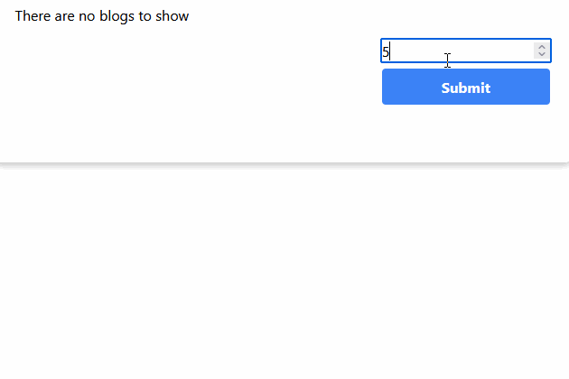
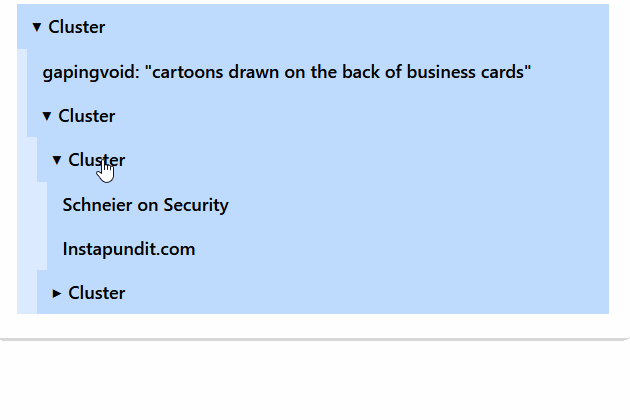

# Blog Clustering Application

## Introduction

Welcome to the Blog Clustering Application! This project implements both **K-Means** and **Hierarchical Clustering** algorithms using **Pearson similarity** on a dataset of **99 blogs**. The application meets the requirements for an **A-grade assignment**, as outlined in the assignment [guidelines](https://coursepress.lnu.se/courses/web-intelligence/assignments/a2).

## GIFs

### K-Means Clustering Results



*Clusters showing related blogs grouped together.*

### Hierarchical Clustering Results



*Interactive tree with expandable and collapsible branches.*


## Features

### K-Means Clustering

- **Pearson Similarity**: Measures the similarity between blogs to ensure accurate clustering.
- **Convergence-Based Stopping**: The algorithm stops when no new assignments are made, ensuring optimal clusters.
- **RESTful Web Service**: Implements a client-server architecture where the client sends requests, and the server responds with HTML.
- **Interactive GUI**: The client presents the clusters and their assignments in a user-friendly interface.

### Hierarchical Clustering

- **Deterministic Results**: Always produces the same clustering result for consistent analysis.
- **Interactive Dendrogram**: Presents results as an expandable and collapsible tree structure within the GUI.
- **Pearson Similarity**: Maintains consistency in similarity measurement across both algorithms.

## Installation

1. **Clone the Repository**

   ```bash
   git clone https://github.com/yourusername/a2-clustering.git
   ```

2. **Navigate to the Project Directory**

   ```bash
   cd a2-clustering
   ```

3. **Install Dependencies**

   ```bash
   bun install
   ```

4. **Run the Application**

   ```bash
   bun run dev
   ```

   *The application will start in development mode with hot reloading enabled.*

   Alternatively, you can start the application using Docker:

   ```bash
   docker compose up
   ```

   This will create a containerized environment and run the application.

## Usage

1. **Access the Application**

   Open your web browser and navigate to `http://localhost:3000`.

2. **K-Means Clustering**

   - Click on **"Goto K kluster"**.
   - Explore different clusters sizes by changing the number of clusters.
   - View the clusters and their blog assignments.
   - Observe how related blogs, like Google and search engine blogs, are grouped together.

3. **Hierarchical Clustering**

   - Click on **"Goto H kluster"**.
   - Explore by expanding and collapsing branches.
   - Analyze the relationships between different blogs.


## Performance

- **Optimized Algorithms**: Implemented performance improvements to speed up cluster generation.
- **Efficient Data Handling**: Uses efficient data structures to manage previous and new cluster assignments.

